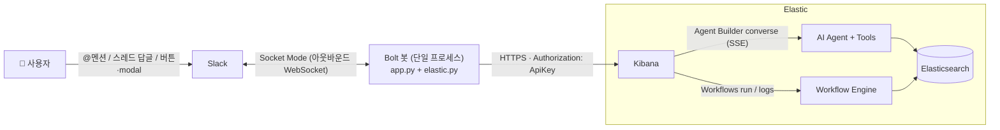
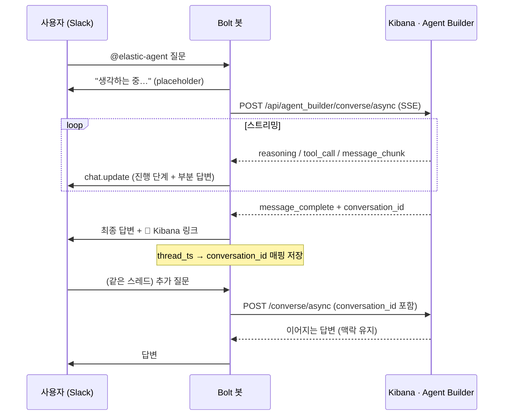
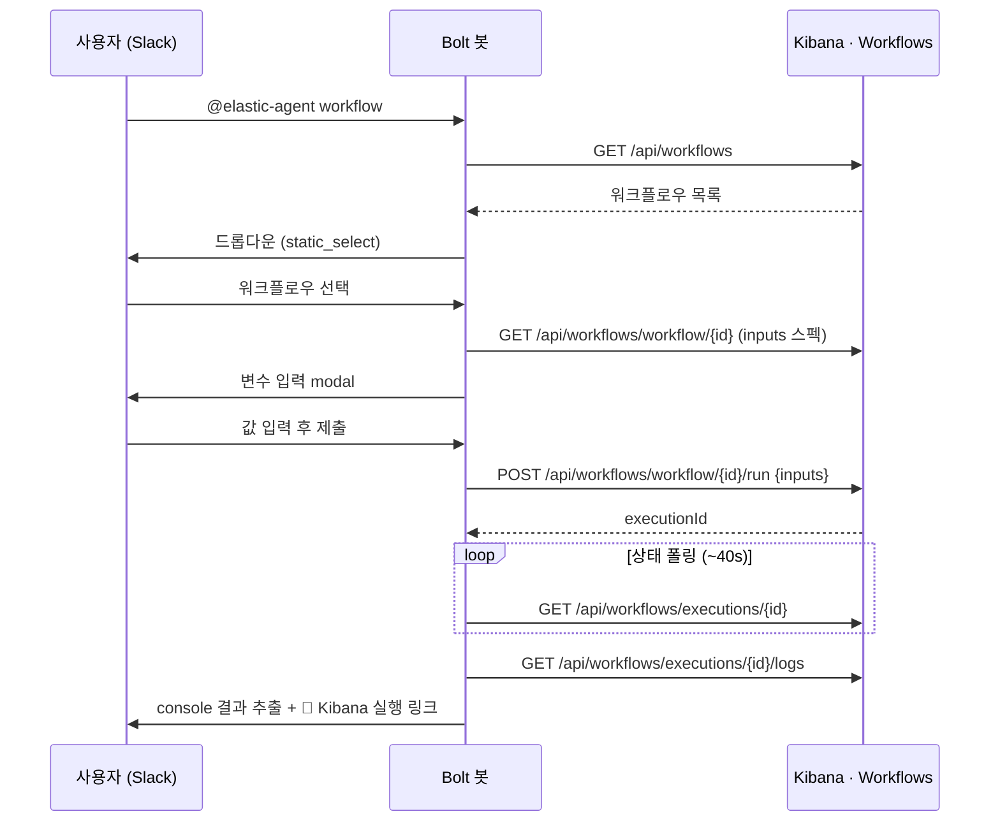

# Elastic × Slack Bot — Agent Builder 대화 & Workflows 실행

[English](./README.md) | **한국어**

> Slack 채널 안에서 **Kibana를 거의 열지 않고**, Elastic의 AI Agent와 자연어로 대화하고
> 자동화 Workflow를 골라 실행하는 데모(POV)입니다. 모든 결과는 메시지 **스레드**로 달리고,
> 자세히 보고 싶으면 **Kibana 딥링크 버튼** 한 번으로 넘어갑니다.

---

## 목차
- [이게 뭔가요? (Elastic을 몰라도 OK)](#이게-뭔가요-elastic을-몰라도-ok)
- [데모로 보여주는 capability](#데모로-보여주는-capability)
- [아키텍처 & 데이터 흐름](#아키텍처--데이터-흐름)
- [빠른 시작](#빠른-시작-quickstart)
- [상세 셋업](#상세-셋업)
- [사용법](#사용법)
- [개발/디버그](#개발디버그)
- [프로젝트 구조](#프로젝트-구조)
- [왜 이런 구조인가 (핵심 설계)](#왜-이런-구조인가-핵심-설계)
- [POV → Production 전환 가이드](#pov--production-전환-가이드)
- [스택 버전에 따라 확인할 것](#스택-버전에-따라-확인할-것)
- [트러블슈팅](#트러블슈팅)
- [Disclaimer](#disclaimer)

---

## 이게 뭔가요? (Elastic을 몰라도 OK)

이 봇은 **Slack ↔ Elastic** 을 잇는 얇은 다리(bridge)입니다. 배경 지식 세 가지만 알면 됩니다.

- **Elasticsearch** — 로그·메트릭·트레이스·보안 이벤트 같은 대용량 데이터를 저장·검색하는 엔진.
  운영(Observability)·보안(Security)·검색(Search) 데이터가 여기에 쌓입니다.
- **Elastic Agent Builder** — 그 데이터 위에서 동작하는 **AI Agent**를 만드는 기능. 사용자가
  자연어로 물으면, Agent가 **스스로 추론(reasoning)** 하고 필요한 **도구(tool, 예: ES|QL 검색)** 를
  호출해 답을 만듭니다. "지난 1시간 5xx 에러 추이 분석해줘" 같은 질문을 받아 처리합니다.
- **Elastic Workflows** — Kibana 안에서 YAML로 정의하는 **자동화/오케스트레이션**. "탐지 룰 목록을
  뽑아라", "이 조건이면 티켓을 만들어라" 같은 작업을 단계(step)로 엮어 실행합니다. 일종의 경량 playbook입니다.

문제는, 이 좋은 기능들이 **Kibana 안에** 있다는 점입니다. 팀이 실제로 일하는 곳은 Slack인데,
질문 하나 하려고 매번 Kibana를 열고 화면을 옮겨다녀야 하죠. **이 봇은 그걸 없앱니다.** Slack에서
멘션 한 번으로 Agent에게 물어보고, 워크플로우를 골라 실행합니다 — 이른바 **ChatOps**입니다.

> 한 줄 요약: **"Elastic의 AI Agent와 자동화를, 팀이 이미 쓰는 Slack 안으로 가져온다."**

---

## 데모로 보여주는 capability

### 시나리오 1 — Agent Builder와 자연어 대화 (멀티턴)
- 채널에서 `@elastic-agent <질문>` → Agent가 답합니다.
- 답이 나오는 동안 **실시간 진행감**: 스피너 + "추론 중 → 도구 실행 → 답변 작성 중" 단계가 보입니다
  (Agent가 무엇을 하고 있는지 투명하게 노출).
- **멀티턴**: 답변이 달린 **스레드에 그냥 이어서 질문**하면(재멘션 불필요) 같은 대화 맥락(chat history)을
  유지한 채 계속 대화합니다.
- 답변 끝에 **🔗 Kibana 대화에서 열기** 버튼 — Kibana의 동일한 대화로 바로 점프.

### 시나리오 2 — Workflow 선택 → 변수 입력 → 실행 → 결과
- `@elastic-agent workflow` → 워크플로우 목록을 **드롭다운**으로 보여줍니다.
- 선택하면 그 워크플로우가 요구하는 **입력 변수 modal**이 뜹니다(필수/선택, 타입, 기본값, 드롭다운 자동 구성).
- 제출하면 실행하고, 완료되면 **결과를 스레드에** 표시합니다. 대부분의 워크플로우는 결과를 별도 output으로
  내보내지 않고 `console` step으로 출력하므로, 봇은 **실행 로그에서 console 메시지를 추출**해 보여줍니다
  (= Kibana 실행 화면에 보이는 내용).
- **🔗 Kibana 실행 보기** 버튼으로 전체 실행 상세로 이동.

---

## 아키텍처 & 데이터 흐름



핵심: 봇은 **밖으로 나가는 연결만** 만듭니다(Slack으로 WebSocket, Kibana로 HTTPS). 그래서
**공인 IP·리버스 프록시·TLS 인증서·인바운드 포트가 전혀 필요 없습니다.** 노트북에서도 그대로 돕니다.

### 시나리오 1 데이터 흐름



### 시나리오 2 데이터 흐름



---

## 빠른 시작 (Quickstart)

**전제**: Python 3.10+, Slack 워크스페이스(앱 설치 권한), Kibana(Agent Builder·Workflows 사용 가능)와 API Key.

```bash
git clone <this-repo> && cd <this-repo>

# 1) 환경변수 채우기
cp .env.example .env
$EDITOR .env            # SLACK_*, KIBANA_* 값 입력

# 2) 실행 (가상환경 생성 + 의존성 설치 + 봇 시작을 한 번에)
./run.sh
```

`run.sh`가 `.venv` 생성 → `requirements.txt` 설치 → `python app.py` 까지 알아서 처리합니다.
수동으로 하려면:

```bash
python3 -m venv .venv
source .venv/bin/activate
pip install -r requirements.txt
python app.py
```

봇이 뜨면 Slack 채널에 봇을 초대(`/invite @elastic-agent`)한 뒤 멘션해 보세요.

---

## 상세 셋업

### 1) Slack 앱 만들기 (manifest 붙여넣기)
[api.slack.com/apps](https://api.slack.com/apps) → **Create New App** → **From an app manifest** → 아래 YAML:

```yaml
display_information:
  name: Elastic Agent
features:
  bot_user:
    display_name: elastic-agent
    always_online: true
oauth_config:
  scopes:
    bot:
      - app_mentions:read
      - chat:write
      - commands
      - channels:history
      - groups:history
settings:
  event_subscriptions:
    bot_events:
      - app_mention
      - message.channels
      - message.groups
  interactivity:
    is_enabled: true
  socket_mode_enabled: true
```

그다음:
- **Basic Information → App-Level Tokens**: `connections:write` scope로 토큰 발급 → `SLACK_APP_TOKEN` (`xapp-…`)
- **Install to Workspace** 후 **Bot User OAuth Token** → `SLACK_BOT_TOKEN` (`xoxb-…`)

> ⚠️ 멀티턴(스레드 답글)을 받으려면 봇이 **그 채널의 멤버**여야 하고, manifest의
> `message.channels`/`message.groups` 이벤트 + `channels:history`/`groups:history` scope가 필요합니다.
> manifest를 바꿨다면 **앱을 재설치(reinstall)** 하세요.

### 2) Kibana API Key 발급
Kibana **Dev Tools** 또는 Stack Management → API keys. Agent Builder + Workflows 권한이 필요합니다(예시):

```json
POST /_security/api_key
{
  "name": "slack-demo",
  "role_descriptors": {
    "slack": {
      "cluster": ["monitor_inference"],
      "indices": [{ "names": ["logs-*","metrics-*"], "privileges": ["read","view_index_metadata"] }],
      "applications": [{
        "application": "kibana-.kibana",
        "privileges": ["feature_agentBuilder.all","feature_workflowsManagement.all","feature_actions.read"],
        "resources": ["space:default"]
      }]
    }
  }
}
```

응답의 **`encoded`** 값을 `KIBANA_API_KEY`에 넣습니다. (feature 권한명은 스택 버전에서 확인하세요.)

### 3) `.env` 채우기
`.env.example`을 복사해 값을 채웁니다. 각 변수 설명은 파일 안 주석 참고.

| 변수 | 설명 |
|---|---|
| `SLACK_BOT_TOKEN` | Bot User OAuth Token (`xoxb-…`) |
| `SLACK_APP_TOKEN` | App-Level Token, `connections:write` (`xapp-…`) |
| `KIBANA_URL` | Kibana 베이스 URL (끝 슬래시 없이) |
| `KIBANA_API_KEY` | API Key의 base64 `encoded` 값 |
| `KIBANA_SPACE` | Kibana Space (기본 `default`) |
| `DEFAULT_AGENT_ID` | 멘션 시 대화할 기본 Agent id |
| `DEBUG_SSE` / `DEBUG_WF` | (선택) 디버그 출력 |

---

## 사용법

| 하고 싶은 것 | Slack에서 |
|---|---|
| Agent에게 질문 | `@elastic-agent 지난 1시간 5xx 에러 추이 분석해줘` |
| 이어서 추가 질문 | **같은 스레드에** 그냥 자연어로 답글 (재멘션 불필요) |
| 워크플로우 실행 | `@elastic-agent workflow` → 드롭다운 선택 → 변수 입력 → 실행 |

- 시나리오 1의 후속 질문은 **첫 답변이 끝난 뒤** 보내세요. (스레드↔대화 매핑이 턴 완료 시 저장됩니다.)
- 워크플로우에 입력 변수가 있으면 modal이 뜹니다. 없으면 바로 실행합니다.

---

## 개발/디버그

이 프로젝트는 데모/개발용이라, 내부에서 무슨 일이 일어나는지 **그대로 들여다볼 수 있게** 디버그 스위치를 둡니다.

```bash
./run.sh --debug        # 아래 둘 다 켬
./run.sh --debug-sse    # Agent Builder SSE 이벤트를 콘솔에 출력
./run.sh --debug-wf     # 워크플로우 실행/로그 JSON 을 콘솔에 출력
```

- **`DEBUG_SSE`** — Agent 대화 중 수신하는 모든 SSE 이벤트(`reasoning`/`tool_call`/`message_chunk` …)를
  타입과 함께 출력합니다. SSE 이벤트 이름이 스택 버전에 따라 바뀌었을 때 원인 파악에 유용합니다.
- **`DEBUG_WF`** — 워크플로우 실행 객체와 로그 JSON 원본을 출력합니다. console 출력이 안 보이거나
  실행 상세 구조가 예상과 다를 때, 실제 키 이름을 확인해 코드를 맞출 수 있습니다.

`.env`에 `DEBUG_SSE=1` / `DEBUG_WF=1`을 직접 넣어도 됩니다.

기타 옵션:

```bash
./run.sh --no-install   # 의존성 설치 건너뛰고 빠르게 재실행
./run.sh --recreate     # .venv 를 지우고 새로 생성
./run.sh --help         # 도움말
```

---

## 프로젝트 구조

```
.
├── app.py            # Slack Bolt 봇: 이벤트/멘션/modal 핸들러, 진행감 렌더링, 결과 표시
├── elastic.py        # Kibana(Agent Builder/Workflows) 호출 담당 얇은 async 클라이언트
├── requirements.txt  # Python 의존성
├── run.sh            # venv 구성 + 설치 + 실행 (개발용 디버그 플래그 포함)
├── .env.example      # 환경변수 템플릿 (→ .env 로 복사)
├── .gitignore
├── README.md         # English
└── README.ko.md      # 한국어
```

- **`app.py`** — Slack 쪽 모든 상호작용. 스피너/진행 단계, 멀티턴(스레드↔대화 매핑), 워크플로우
  목록·modal·결과 렌더링, console 로그 추출.
- **`elastic.py`** — Kibana plugin API 호출만 담당(쓰기/실행 경로). 응답 형태를 방어적으로 파싱하고,
  inputs 3가지 형식 정규화, 타입 변환, 실행/로그 조회 등을 제공.

---

## 왜 이런 구조인가 (핵심 설계)

**Q. Slack ↔ Elasticsearch 직결은 안 되나?**
인터랙티브 시나리오에서는 안 됩니다. Slack의 Events/Slash/Interactivity는 (1) 요청 서명 검증,
(2) **3초 내 ACK**, (3) Block Kit JSON 응답, (4) modal(`views.open`) 트리거를 요구합니다.
Kibana/Elasticsearch는 이 프로토콜을 네이티브로 처리하지 못합니다. 그래서 **얇은 중개 프로세스**가
반드시 필요하고, **가장 단순한 형태가 바로 이 단일 Bolt 봇**입니다(별도 DB/queue/공인 URL 불필요).

**Q. 왜 Socket Mode인가?**
공인 엔드포인트 없이 **아웃바운드 WebSocket**만으로 Slack 이벤트를 받기 때문입니다. POV/로컬 데모에
이상적입니다(방화벽 뒤, 노트북에서도 동작). 단, 운영 규모에는 권장되지 않습니다 → 아래 전환 가이드 참고.

**Q. 쓰기 경로는 왜 Kibana API인가?**
Agent 대화·워크플로우 실행은 raw Elasticsearch가 아니라 **Kibana 서버 플러그인**입니다. 그래서
이 경로들은 반드시 Kibana API를 통합니다(인증은 Kibana API Key 하나로 통일).

---

## POV → Production 전환 가이드

이 데모는 **POV(Proof of Value) 목적의 로컬 실행**입니다. 전사/운영 적용 시 바꿔야 할 부분을 정리합니다.

| 영역 | 현재 (POV) | Production 권장 | 이유 |
|---|---|---|---|
| **Slack 연결** | Socket Mode (WebSocket) | **HTTP (Events API + Request URL)** | WebSocket은 stateful해 수평 확장이 어렵습니다. HTTP는 공인 endpoint + 서명 검증 + **3초 ACK 후 비동기 워커**로 처리하면 무상태 스케일이 쉽습니다. |
| **상태 저장** | `THREAD_CONV` 인메모리 dict | **Redis 등 외부 저장소** | 봇 재시작/다중 인스턴스에서도 스레드↔대화 매핑이 유지되어야 멀티턴이 끊기지 않습니다. |
| **인증/권한** | 공유 API Key 1개 | **사용자별 Elastic 신원 매핑** (Slack user → per-user API Key) | Agent의 tool은 "현재 사용자"로 실행되므로, 사용자별 키로 **RBAC·Space 격리**가 가능합니다. 공유 키는 모두가 같은 권한을 갖게 됩니다. |
| **비용/쿼터** | 없음 | **토큰 사용량 추적 + 앱 레벨 쿼터** | Agent Builder consumption을 모니터링하고, 사용자/채널별 rate limit·예산 한도를 앱에서 강제합니다. |
| **배포** | 노트북/단일 프로세스 | **무상태 복제본 + LB**, 컨테이너화, **Enterprise Grid org-level 설치** | 가용성·확장성. 봇이 특정 머신에 묶이지 않게 합니다. |
| **시크릿 관리** | `.env` 파일 | **Secrets Manager / Vault** | 토큰·API Key를 코드/디스크가 아닌 비밀 저장소에서 주입합니다. |
| **신뢰성** | 단순 폴링/예외 무시 | **재시도·타임아웃·idempotency·DLQ** | Slack 이벤트 재전송, Task Manager 지연, 네트워크 오류를 견디게 합니다. |
| **관측성** | 콘솔 로그(`DEBUG_*`) | **봇 자체를 Elastic APM/EDOT로 계측** | 봇의 지연·오류·트레이스를 Elastic으로 보내 dogfooding. 운영 가시성 확보. |

### 전환 체크리스트
- [ ] Socket Mode → HTTP 전환, 3초 ACK 후 작업을 **비동기 큐/워커**로 이관
- [ ] `THREAD_CONV` → Redis(또는 동급) 외부화, TTL 설정
- [ ] Slack 사용자 ↔ Elastic 신원/Space 매핑, **사용자별 API Key** 발급·교체 전략
- [ ] 토큰 사용량/비용 모니터링 + 사용자·채널 단위 rate limit
- [ ] 컨테이너 + 무상태 복제본 + LB, 헬스체크
- [ ] 시크릿을 Vault/Secrets Manager에서 주입(`.env` 제거)
- [ ] 재시도/타임아웃/idempotency, 알림(실패 시 on-call)
- [ ] 봇 트레이싱(Elastic APM/EDOT), 감사 로그

> 참고: Agent Builder는 **MCP 서버(`/api/agent_builder/mcp`)** 와 A2A도 노출합니다. 봇을 MCP
> 클라이언트로 붙이는 변형 아키텍처도 가능합니다.

---

## 스택 버전에 따라 확인할 것

Agent Builder·Workflows는 **Tech Preview**라 9.x 사이에서 경로/응답이 바뀔 수 있습니다. 코드는 응답을
방어적으로 파싱하지만, 본인 스택에서 아래를 확인하세요(Dev Tools에서 `GET kbn:/api/...`로 점검 가능).

| 용도 | 코드가 쓰는 경로 | 확신도 | 비고 |
|---|---|---|---|
| Agent 대화(스트리밍) | `POST /api/agent_builder/converse/async` | 높음 | SSE event 이름은 9.x에서 변동 가능 (`DEBUG_SSE`로 확인) |
| Agent 목록/대화조회 | `GET /api/agent_builder/agents`, `/conversations/{id}` | 높음 | |
| 워크플로우 실행 | `POST /api/workflows/workflow/{id}/run` `{inputs:{}}` | 높음 | |
| 워크플로우 목록 | `GET /api/workflows` | 중간 | 응답 래핑 키를 방어적으로 파싱 |
| 워크플로우 정의(inputs) | `GET /api/workflows/workflow/{id}` | 중간 | list / JSON Schema / dict-of-specs 3형식 모두 정규화 |
| 실행 상태 | `GET /api/workflows/executions/{id}` (+후보) | 중간 | 런타임 step 출력은 없고 정의+메타만 줄 수 있음 |
| 실행 로그(console) | `GET /api/workflows/executions/{id}/logs` (+후보) | 중간 | 엔진 lifecycle 로그를 걸러 console 메시지만 추출 |
| Kibana 딥링크 | `/app/agent_builder/...`, `/app/workflows/...` | 중간 | 앱 경로가 `/app/onechat`일 수 있음 — Kibana URL에서 확인 |

---

## 트러블슈팅

- **`SSL: CERTIFICATE_VERIFY_FAILED`** (macOS / python.org 빌드)
  → `app.py`가 `certifi` 번들을 `SSL_CERT_FILE`로 강제 지정해 해결합니다. 그래도 나면
  `/Applications/Python 3.x/Install Certificates.command`를 한 번 실행하세요.
- **멘션은 되는데 스레드 답글에 반응이 없음**
  → 봇이 그 채널의 **멤버**인지, manifest에 `message.channels`/`message.groups`가 있는지,
  앱을 **재설치**했는지 확인하세요.
- **워크플로우 실행은 됐는데 결과가 비어 있음**
  → 그 워크플로우가 `console`/index 저장으로 끝나는 경우입니다. `./run.sh --debug-wf`로 실행 로그
  JSON을 확인하세요. console 출력이 로그에 있으면 봇이 추출합니다. 인덱스 저장형은 "Kibana 실행
  보기"로 확인하거나, 워크플로우 끝에 **요약용 `console` step**을 두는 것을 권장합니다.
- **Agent 답변이 비어 있음**
  → `DEBUG_SSE`로 어떤 이벤트가 오는지 확인하세요. SSE 이벤트 이름이 스택 버전에서 달라졌을 수 있습니다.
- **Kibana 링크가 404**
  → 딥링크 앱 경로(`/app/agent_builder` vs `/app/onechat`, `/app/workflows`)를 본인 Kibana에서 확인해
  `elastic.py`의 URL 빌더를 맞추세요.

---

## Disclaimer

데모/POV 목적의 예제입니다. Elastic의 Agent Builder·Workflows는 작성 시점 기준 **Tech Preview**이며,
API 경로·응답 형태는 변경될 수 있습니다. 운영 적용 전 위 [전환 가이드](#pov--production-전환-가이드)를
검토하세요. 이 저장소는 공식 Elastic 제품이 아닙니다.
