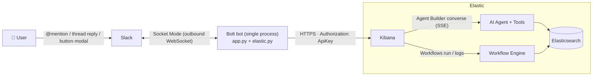
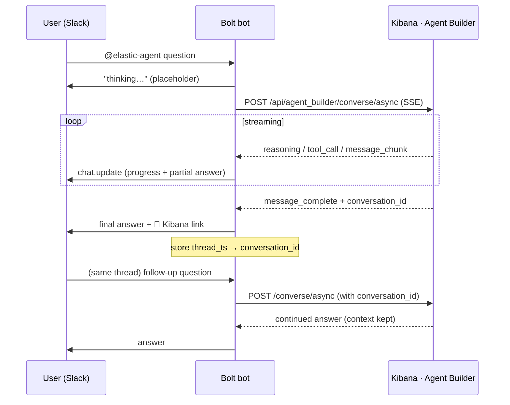
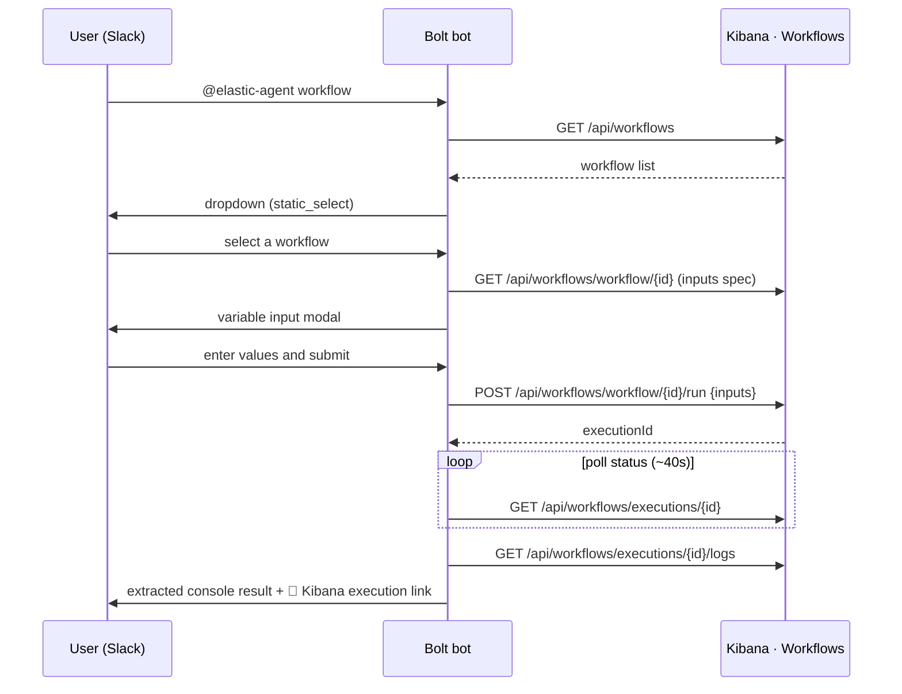

# Elastic × Slack Bot — Chat with Agent Builder & Run Workflows

**English** | [한국어](./README.ko.md)

> A proof-of-value (POV) demo that lets your team talk to Elastic's AI Agent and run automation
> Workflows **right inside Slack — without opening Kibana**. Every result is posted in the message
> **thread**, with a **deep-link button** to jump into Kibana when you want the full view.

---

## Table of Contents
- [What is this? (No Elastic knowledge required)](#what-is-this-no-elastic-knowledge-required)
- [Capabilities this demo shows](#capabilities-this-demo-shows)
- [Architecture & data flow](#architecture--data-flow)
- [Quickstart](#quickstart)
- [Detailed setup](#detailed-setup)
- [Usage](#usage)
- [Development / debugging](#development--debugging)
- [Project structure](#project-structure)
- [Why this design](#why-this-design)
- [POV → Production guide](#pov--production-guide)
- [Verify against your stack version](#verify-against-your-stack-version)
- [Troubleshooting](#troubleshooting)
- [Learn more (official Elastic docs)](#learn-more-official-elastic-docs)
- [Disclaimer](#disclaimer)

---

## What is this? (No Elastic knowledge required)

This bot is a thin **bridge between Slack and Elastic**. Three concepts are enough to follow along:

- **Elasticsearch** — an engine that stores and searches large volumes of data such as logs, metrics,
  traces, and security events. Your Observability, Security, and Search data lives here.
- **[Elastic Agent Builder](https://www.elastic.co/elasticsearch/agent-builder)** (GA) — build **AI
  Agents** on top of your Elasticsearch data. Given a natural-language question, an agent **reasons** on
  its own and **calls tools** — built-in or custom, e.g. an **ES|QL** query — so answers are *grounded
  in your data*. It can handle requests like "analyze the 5xx error trend over the last hour." Agents are
  reachable from Kibana chat or programmatically, and can be exposed to external clients (Claude Desktop,
  Cursor, LangChain, …) over the built-in **MCP** and **A2A** servers.
- **[Elastic Workflows](https://www.elastic.co/elasticsearch/workflows)** (GA in 9.4) — the **native
  automation engine** built into the Elastic platform. You declare automation as **YAML** (triggers →
  steps → actions) that runs *right where your data lives* — no external automation tool or middleware.
  Think of it as a versionable playbook. Agent Builder and Workflows **compose bidirectionally**: an
  agent can trigger a workflow, and a workflow can call an agent (the `ai.agent` step).

The catch is that these capabilities live **inside Kibana**, while teams actually work in Slack. Asking
one question means opening Kibana and context-switching every time. **This bot removes that friction.**
From Slack, you mention the bot to ask the Agent, or pick a workflow and run it — classic **ChatOps**.

> One line: **"Bring Elastic's AI Agent and automation into the Slack your team already uses."**

---

## Capabilities this demo shows

### Scenario 1 — Natural-language chat with Agent Builder (multi-turn)
- In a channel, `@elastic-agent <question>` → the Agent answers.
- While the answer is being produced you get **live progress**: a spinner plus the stages
  "reasoning → running tool → writing answer" (transparent view of what the Agent is doing).
- **Multi-turn**: just **reply in the thread** (no need to re-mention) and the conversation continues
  with the same chat history / context.
- The answer ends with an **🔗 Open in Kibana** button that jumps to the same conversation in Kibana.

### Scenario 2 — Pick a workflow → enter variables → run → see results
- `@elastic-agent workflow` → shows the list of workflows as a **dropdown**.
- Picking one opens an **input modal** for the variables that workflow requires (required/optional,
  type, defaults, and dropdowns are built automatically).
- On submit it runs, and when finished the **result is posted in the thread**. Most workflows don't
  emit a dedicated output — they print via a `console` step — so the bot **extracts the console
  messages from the execution logs** (i.e. what you'd see in the Kibana execution view).
- An **🔗 Open execution in Kibana** button takes you to the full execution detail.

---

## Architecture & data flow



Key point: the bot only makes **outbound connections** (a WebSocket to Slack, HTTPS to Kibana). That
means **no public IP, reverse proxy, TLS certificate, or inbound port is needed** — it even runs from a laptop.

### Scenario 1 data flow



### Scenario 2 data flow



---

## Quickstart

**Prerequisites**: Python 3.10+, a Slack workspace (with permission to install an app), and Kibana
(with Agent Builder · Workflows available) plus an API Key.

```bash
git clone <this-repo> && cd <this-repo>

# 1) Fill in environment variables
cp .env.example .env
$EDITOR .env            # enter SLACK_* and KIBANA_* values

# 2) Run (creates venv + installs deps + starts the bot in one go)
./run.sh
```

`run.sh` handles `.venv` creation → installing `requirements.txt` → `python app.py`. To do it manually:

```bash
python3 -m venv .venv
source .venv/bin/activate
pip install -r requirements.txt
python app.py
```

Once the bot is up, invite it to a channel (`/invite @elastic-agent`) and mention it.

---

## Detailed setup

### 1) Create the Slack app (paste a manifest)
[api.slack.com/apps](https://api.slack.com/apps) → **Create New App** → **From an app manifest** → paste this YAML:

```yaml
display_information:
  name: Elastic Agent
features:
  bot_user:
    display_name: elastic-agent
    always_online: true
oauth_config:
  scopes:
    bot:
      - app_mentions:read
      - chat:write
      - commands
      - channels:history
      - groups:history
settings:
  event_subscriptions:
    bot_events:
      - app_mention
      - message.channels
      - message.groups
  interactivity:
    is_enabled: true
  socket_mode_enabled: true
```

Then:
- **Basic Information → App-Level Tokens**: create a token with the `connections:write` scope → `SLACK_APP_TOKEN` (`xapp-…`)
- After **Install to Workspace**, copy the **Bot User OAuth Token** → `SLACK_BOT_TOKEN` (`xoxb-…`)

> ⚠️ For multi-turn (thread replies) to work, the bot must be a **member of the channel**, and the
> manifest needs the `message.channels`/`message.groups` events plus the `channels:history`/`groups:history`
> scopes. If you changed the manifest, **reinstall the app**.

### 2) Create a Kibana API Key
Kibana **Dev Tools** or Stack Management → API keys. You need Agent Builder + Workflows privileges (example):

```json
POST /_security/api_key
{
  "name": "slack-demo",
  "role_descriptors": {
    "slack": {
      "cluster": ["monitor_inference"],
      "indices": [{ "names": ["logs-*","metrics-*"], "privileges": ["read","view_index_metadata"] }],
      "applications": [{
        "application": "kibana-.kibana",
        "privileges": ["feature_agentBuilder.all","feature_workflowsManagement.all","feature_actions.read"],
        "resources": ["space:default"]
      }]
    }
  }
}
```

Put the **`encoded`** value from the response into `KIBANA_API_KEY`. (Verify the feature privilege names on your stack version.)

### 3) Fill in `.env`
Copy `.env.example` and fill in the values. Each variable is documented in the file's comments.

| Variable | Description |
|---|---|
| `SLACK_BOT_TOKEN` | Bot User OAuth Token (`xoxb-…`) |
| `SLACK_APP_TOKEN` | App-Level Token with `connections:write` (`xapp-…`) |
| `KIBANA_URL` | Kibana base URL (no trailing slash) |
| `KIBANA_API_KEY` | The API Key's base64 `encoded` value |
| `KIBANA_SPACE` | Kibana Space (default `default`) |
| `DEFAULT_AGENT_ID` | Default Agent id to chat with on mention |
| `DEBUG_SSE` / `DEBUG_WF` | (optional) debug output |

---

## Usage

| What you want | In Slack |
|---|---|
| Ask the Agent | `@elastic-agent analyze the 5xx error trend over the last hour` |
| Follow up | reply **in the same thread** in natural language (no re-mention) |
| Run a workflow | `@elastic-agent workflow` → pick from dropdown → enter variables → run |

- Send Scenario 1 follow-ups **after the first answer completes** (the thread↔conversation mapping is
  saved when the turn finishes).
- If a workflow has input variables, a modal appears. If not, it runs immediately.

---

## Development / debugging

This project is for demos/development, so it exposes debug switches to let you **see exactly what's
happening** inside.

```bash
./run.sh --debug        # turns on both below
./run.sh --debug-sse    # print Agent Builder SSE events to the console
./run.sh --debug-wf     # print workflow execution/log JSON to the console
```

- **`DEBUG_SSE`** — prints every SSE event received during an Agent conversation
  (`reasoning`/`tool_call`/`message_chunk` …) with its type. Handy when SSE event names change across
  stack versions.
- **`DEBUG_WF`** — prints the raw execution object and log JSON. Useful when console output isn't
  showing up or the execution detail structure differs from expectations — you can confirm the real
  keys and adjust the code.

You can also set `DEBUG_SSE=1` / `DEBUG_WF=1` directly in `.env`.

Other options:

```bash
./run.sh --no-install   # skip dependency install for a fast restart
./run.sh --recreate     # delete and recreate .venv
./run.sh --help         # help
```

---

## Project structure

```
.
├── app.py            # Slack Bolt bot: event/mention/modal handlers, progress rendering, result display
├── elastic.py        # Thin async client for Kibana (Agent Builder / Workflows) calls
├── requirements.txt  # Python dependencies
├── run.sh            # venv setup + install + run (with dev debug flags)
├── .env.example      # Environment variable template (→ copy to .env)
├── .gitignore
├── README.md         # English (this file)
└── README.ko.md      # Korean
```

- **`app.py`** — all Slack-side interaction: spinner/progress stages, multi-turn (thread↔conversation
  mapping), workflow list · modal · result rendering, and console-log extraction.
- **`elastic.py`** — only Kibana plugin API calls (write/run paths). Defensive response parsing,
  normalization of the 3 input formats, type coercion, execution/log lookups, etc.

---

## Why this design

**Q. Can't Slack talk to Elasticsearch directly?**
Not for interactive scenarios. Slack's Events/Slash/Interactivity require (1) request signature
verification, (2) an **ACK within 3 seconds**, (3) Block Kit JSON responses, and (4) modal
(`views.open`) triggers. Kibana/Elasticsearch can't handle this protocol natively. So a **thin
intermediary process is required**, and **the simplest form is this single Bolt bot** (no separate
DB/queue/public URL).

**Q. Why Socket Mode?**
Because it receives Slack events over an **outbound WebSocket** with no public endpoint. That's ideal
for a POV/local demo (works behind a firewall, even on a laptop). It is not recommended at production
scale, though — see the transition guide below.

**Q. Why go through the Kibana API for the write paths?**
Agent conversations and workflow runs are **Kibana server plugins**, not raw Elasticsearch. So those
paths must go through the Kibana API (auth is unified via a single Kibana API Key).

---

## POV → Production guide

This demo is a **local, proof-of-value setup**. Here's what to change for org-wide / production use.

| Area | Now (POV) | Recommended (Production) | Why |
|---|---|---|---|
| **Slack connection** | Socket Mode (WebSocket) | **HTTP (Events API + Request URL)** | WebSocket is stateful and hard to scale horizontally. HTTP scales statelessly when you use a public endpoint + signature verification + **an async worker after the 3s ACK**. |
| **State** | in-memory `THREAD_CONV` dict | **a persistent store — e.g. a small Elasticsearch index (reuse the existing connection) or Redis** | Only the **Slack thread_ts ↔ conversation_id mapping** must survive restarts / span instances so multi-turn doesn't break. (The conversation *content* is already durable in Elasticsearch — see note below.) |
| **Auth / authorization** | one shared API Key | **per-user Elastic identity mapping** (Slack user → per-user API Key) | An Agent's tools run as the "current user," so per-user keys enable **RBAC and Space isolation**. A shared key gives everyone the same privileges. |
| **Cost / quota** | none | **token-usage tracking + app-level quotas** | Agent Builder exposes per-conversation **token usage** (consumption API) — monitor it and enforce per-user/channel rate limits in the app. Note Workflows billing: execution-based on Elastic Cloud Serverless (from May 1, 2026); Hosted/self-managed are in a promotional period (not yet charged). |
| **Deployment** | laptop / single process | **stateless replicas behind an LB**, containerized, **Enterprise Grid org-level install** | Availability and scalability; the bot shouldn't be tied to one machine. |
| **Secrets** | `.env` file | **Secrets Manager / Vault** | Inject tokens/API keys from a secret store rather than code/disk. |
| **Reliability** | simple polling / swallowed errors | **retries · timeouts · idempotency · DLQ** | Tolerate Slack event re-deliveries, Task Manager latency, and network errors. |
| **Observability** | console logs (`DEBUG_*`) | **instrument the bot with Elastic APM / EDOT** | Send the bot's latency/errors/traces to Elastic (dogfooding) for operational visibility. |

> **A note on state — isn't Elasticsearch already doing this?** Partly, yes. There are two different
> kinds of state:
> 1. **Conversation content (chat history)** — already persisted in Elasticsearch by Agent Builder and
>    retrievable via `GET /api/agent_builder/conversations/{id}`. Durability here is solved; the bot
>    doesn't need to store it.
> 2. **The Slack `thread_ts` ↔ `conversation_id` mapping** — the *only* thing the bot keeps in memory.
>    Elastic doesn't store this glue (it doesn't know which Slack thread a conversation belongs to). If
>    the bot restarts, the mapping is lost and follow-ups in an existing thread can't find which
>    conversation to continue — even though the conversation itself is safe in Elastic.
>
> Since the bot already talks to Elastic, the most natural home for that mapping is a **small
> Elasticsearch index** (e.g. `slack-thread-map`, docs `{thread_ts, conversation_id}`) — no extra
> infrastructure. Redis is just an alternative when you want sub-millisecond lookups or TTL eviction.
> You can also avoid an external store entirely by attaching the `conversation_id` to the thread's bot
> message via **Slack message metadata** and reading it back.

### Transition checklist
- [ ] Switch Socket Mode → HTTP; move work to an **async queue/worker** after the 3s ACK
- [ ] Persist the `thread_ts → conversation_id` mapping (a small **Elasticsearch index** reuses the
      existing connection; Redis with TTL is an alternative)
- [ ] Map Slack users ↔ Elastic identity/Space; strategy for issuing/rotating **per-user API Keys**
- [ ] Token-usage/cost monitoring + per-user/channel rate limits
- [ ] Containerize + stateless replicas behind an LB, with health checks
- [ ] Inject secrets from Vault/Secrets Manager (drop `.env`)
- [ ] Retries/timeouts/idempotency, and alerting (page on-call on failure)
- [ ] Bot tracing (Elastic APM/EDOT), audit logs

> Note: Agent Builder also exposes an **MCP server (`/api/agent_builder/mcp`)** and A2A. An alternative
> architecture is to attach the bot as an MCP client.

---

## Verify against your stack version

**Agent Builder is GA (since 9.3) and Workflows is GA (9.4, enabled by default).** That said, this demo
calls several APIs whose exact paths and response shapes can still vary by minor version — and a few
(e.g. the async converse stream and execution logs) aren't all in the public API reference yet. So
verify the following on your stack (check with `GET kbn:/api/...` in Dev Tools). The client already
parses responses defensively.

| Purpose | Path used by the code | Confidence | Notes |
|---|---|---|---|
| Agent chat (streaming) | `POST /api/agent_builder/converse/async` | High | SSE event names may vary in 9.x (check with `DEBUG_SSE`) |
| Agent list / conversation | `GET /api/agent_builder/agents`, `/conversations/{id}` | High | |
| Run workflow | `POST /api/workflows/workflow/{id}/run` `{inputs:{}}` | High | |
| Workflow list | `GET /api/workflows` | Medium | response wrapping key parsed defensively |
| Workflow definition (inputs) | `GET /api/workflows/workflow/{id}` | Medium | normalizes all 3 formats: list / JSON Schema / dict-of-specs |
| Execution status | `GET /api/workflows/executions/{id}` (+candidates) | Medium | may return definition+metadata without runtime step outputs |
| Execution logs (console) | `GET /api/workflows/executions/{id}/logs` (+candidates) | Medium | filters engine lifecycle logs and extracts console messages |
| Kibana deep links | `/app/agent_builder/...`, `/app/workflows/...` | Medium | the app path may be `/app/onechat` — verify in your Kibana URL |

---

## Troubleshooting

- **`SSL: CERTIFICATE_VERIFY_FAILED`** (macOS / python.org build)
  → `app.py` forces the `certifi` bundle via `SSL_CERT_FILE` to fix this. If it still happens, run
  `/Applications/Python 3.x/Install Certificates.command` once.
- **Mentions work, but thread replies get no response**
  → Check that the bot is a **member of the channel**, that the manifest includes
  `message.channels`/`message.groups`, and that you **reinstalled** the app.
- **The workflow ran but the result is empty**
  → That workflow ends via `console`/index write. Run `./run.sh --debug-wf` to inspect the execution
  log JSON. If console output is in the logs, the bot extracts it. For index-writing workflows, check
  via "Open execution in Kibana," or add a **summary `console` step** at the end of the workflow.
- **The Agent answer is empty**
  → Use `DEBUG_SSE` to see which events arrive. SSE event names may have changed on your stack version.
- **Kibana link 404s**
  → Verify the deep-link app path (`/app/agent_builder` vs `/app/onechat`, `/app/workflows`) in your
  Kibana and adjust the URL builders in `elastic.py`.

---

## Learn more (official Elastic docs)

- **Elastic Agent Builder** — overview & get started: <https://www.elastic.co/docs/explore-analyze/ai-features/elastic-agent-builder>
- **Elastic Workflows** — overview: <https://www.elastic.co/docs/explore-analyze/workflows>
- **What's new in Elastic 9.4** (Workflows GA, Agent Builder updates): <https://www.elastic.co/blog/whats-new-elastic-9-4-0>
- Product pages: [Agent Builder](https://www.elastic.co/elasticsearch/agent-builder) · [Workflows](https://www.elastic.co/elasticsearch/workflows)
- Background: [Agent Builder & context engineering](https://www.elastic.co/search-labs/blog/elastic-ai-agent-builder-context-engineering-introduction) · [Building automation with Workflows](https://www.elastic.co/search-labs/blog/elastic-workflows-automation)

---

## Disclaimer

A demo / POV example built by an Elastic Solutions Architect to showcase **Elastic Agent Builder** and
**Elastic Workflows** in a ChatOps setting. Both features are GA (Agent Builder since 9.3, Workflows in
9.4), but this bot uses some APIs that are version-specific or not yet in the public reference, so paths
and response shapes may differ on your stack — review the
[verification table](#verify-against-your-stack-version) and the
[transition guide](#pov--production-guide) before production use. This repository is a community sample,
not an official Elastic product.
